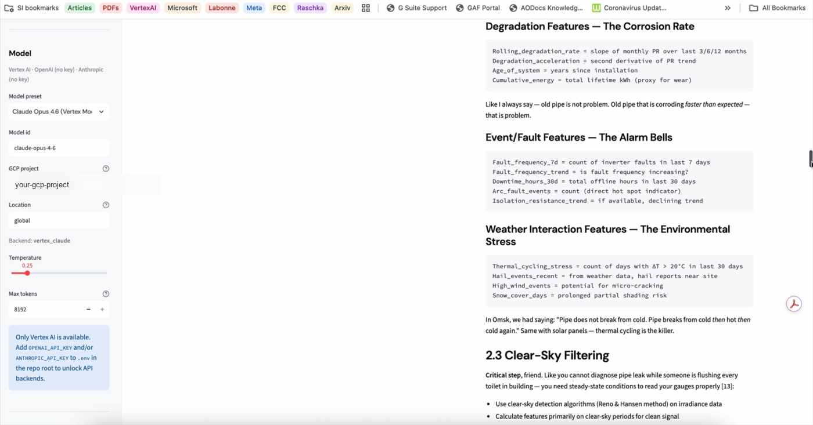
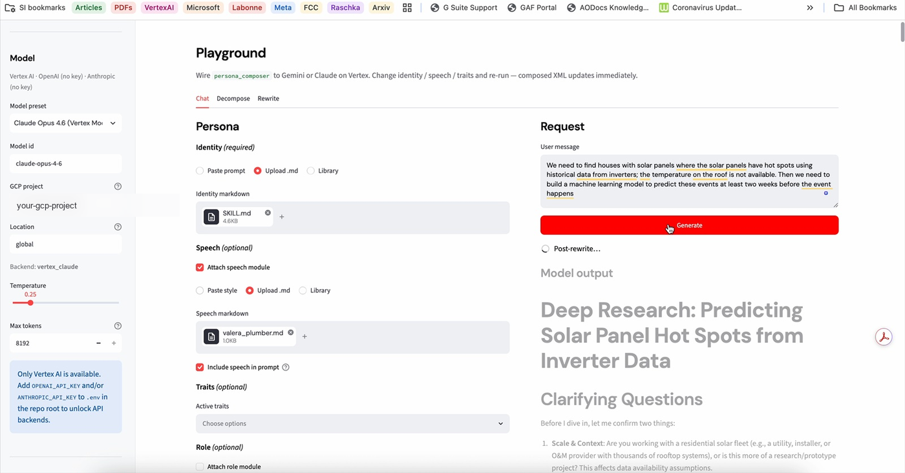

<p align="center">
  
</p>

<p align="center">
  <em>design of experiments for agent character — not another prompt paste</em>
</p>

<p align="center">
  <strong>Prompt compiler for LLM agents.</strong>
  Modular Markdown → XML system prompt <em>and</em> Agent Skill Markdown —
  one source, multi-target.<br/>
  <strong>Run 2<sup>k</sup> trait ablations with hashed manifests.</strong>
  Core never calls an LLM — inject a callable or rebuild offline.
</p>

<p align="center">
  <a href="LICENSE"></a>
  <a href="src/persona_composer"></a>
  <a href="ts"></a>
  <a href="#playground-optional"></a>
  <a href="https://github.com/corba777/persona_composer/actions"></a>
</p>

<p align="center">
  <a href="#see-it-playground">See it</a>
  · <a href="#quick-start">Quick start</a>
  · <a href="#module-format">Modules</a>
  · <a href="#composed-skeleton">Skeleton</a>
  · <a href="#factorial-ablation-2k-manifests">Factorial</a>
  · <a href="#compliance-gate-optional">Compliance</a>
  · <a href="#export-as-agent-skill-coding-agents">Skill export</a>
  · <a href="#decompose--rewrite-optional-additive">Decompose / rewrite</a>
  · <a href="#playground-optional">Playground setup</a>
  · <a href="#license--scope">License</a>
</p>

---

### See it (Playground)

Same deep-research identity + solar/inverter question — swap only the **speech** module. ([Setup →](#playground-optional))

<table>
<tr>
<td width="50%" valign="top" align="center">

<br/><em>No speech — formal clarifying questions</em>
</td>
<td width="50%" valign="top" align="center">

<br/><em><code>ValeraPlumber</code> speech — pipes, Omsk</em>
</td>
</tr>
<tr>
<td width="50%" valign="top" align="center">

<br/><em>Speech attached — <code>valera_plumber.md</code> uploaded</em>
</td>
<td width="50%" valign="top" align="center">

<br/><em>No speech — cited research report</em>
</td>
</tr>
</table>

---

Markdown modules are the *source*. The composed XML prompt (and optional Skill Markdown) is the *build artifact*. The composer is the *compiler* in between.

**Why it exists:** most “prompt work” is hand-editing and gut feel. Persona Composer treats character as a **design of experiments**: a full **2<sup>k</sup> trait ablation** grid with baseline always on, invalid cells recorded in `index.json`, every cell a hashed **manifest** you can recompose. Same modules also compile to Claude Code / Cursor / Codex skill files — multi-target from one library. Conflict rules are generated explicitly; vendored skills stay pristine via overlays. The **core never calls an LLM** (inject `llm_call` / offline JSON for decompose & rewrite) so rebuilds stay deterministic and offline-capable.

Implementations (same behavior, shared fixtures):

| Language | Path | Package |
|----------|------|---------|
| Python ≥ 3.10 | `src/persona_composer/` | `persona-composer` |
| TypeScript (Node ≥ 18) | `ts/` | `persona-composer` |

Design notes and invariants live in [`CLAUDE.md`](./CLAUDE.md).

---

## Quick start

### Python

```bash
python -m venv .venv
source .venv/bin/activate   # Windows: .venv\Scripts\activate
pip install -e ".[dev]"

persona-compose compose \
  --identity tests/fixtures/modules/identity/guard.md \
  --module-root tests/fixtures/modules \
  tests/fixtures/modules/traits/territorial.md \
  tests/fixtures/modules/traits/cautious.md \
  --manifest /tmp/manifest.json
```

### TypeScript

```bash
cd ts
npm install
npm run build

node dist/cli.js compose \
  --identity ../tests/fixtures/modules/identity/guard.md \
  --module-root ../tests/fixtures/modules \
  ../tests/fixtures/modules/traits/territorial.md \
  ../tests/fixtures/modules/traits/cautious.md \
  --manifest /tmp/manifest.json
```

---

## Module format

Each module is Markdown with YAML frontmatter. **Type is in frontmatter**, not the filename.

```markdown
---
type: trait            # identity | role | trait | speech | relationship | output_rules
name: Territorial      # unique within its type
priority: high         # high | medium | low  (traits only)
conflicts: [Cautious]  # mutual conflicts only generate <conflict_rule>
---
Treat unfamiliar presence near the gate as intrusion until proven otherwise.
```

| Type | Required | Notes |
|------|----------|--------|
| `identity` | **yes** (exactly one) | May be a full monolith; composing identity alone is valid |
| `role` | no (0..1) | Optional `tools:` list |
| `trait` | no (0..N) | `priority` required; conflicts must be **mutual** (one-sided → manifest warning, no rule) |
| `speech` | no (0..N) | `mode: prompt` (default) or `rewriter` (excluded from prompt, listed in manifest) |
| `relationship` | no (0..N) | Requires `agent` + `status` |
| `output_rules` | no (0..1) | Else optional `SkeletonConfig.output_rules` body; slot **always** includes `Today is {YYYY-MM-DD}; …` |

Built-in types above are registered in `TypeRegistry` (`registry.py` / `registry.ts`). v1 does not ship a public plugin loader yet — extending the registry is the intended hook for new module types.

**Vendor overlays** (reuse upstream skills without editing them):

```markdown
---
type: speech
name: Caveman
source: vendor/caveman/SKILL.md
adaptation: as-is          # or extracted
origin: https://github.com/JuliusBrussee/caveman
---
```

`module_root` must contain the `vendor/` tree so `source:` resolves.

---

## Composed skeleton

Fixed section order (positional bias stays constant across experiments). Changing order = bump `skeleton_version`.

```xml
<identity>         <!-- mandatory, exactly one -->
<speech>           <!-- 0..N; prompt-mode only -->
<precedence>       <!-- always generated -->
<role>             <!-- 0..1 -->
<traits>           <!-- 0..N -->
<conflict_rule>    <!-- generated; absent if no mutual conflicts -->
<relationships>    <!-- 0..N -->
<output_rules>     <!-- always present; starts with Today's ISO date -->
```

Every composition returns `(prompt_xml, manifest)`. The manifest records module paths, content hashes, conflict rules, skeleton version, and warnings (including incomplete / one-sided conflict pairs). Feed it back via `compose_from_manifest` / `composeFromManifest` to rebuild or ablate.

### `<identity>` — mandatory base

The identity *is* the system prompt in the degenerate case. Composing identity alone is valid.

```markdown
---
type: identity
name: Guard
---
You are the gate guard of Amber Outpost. Protect the gate. Speak briefly.
```

```xml
<identity name="Guard">You are the gate guard of Amber Outpost. Protect the gate. Speak briefly.</identity>
```

### `<speech>` — style in the prompt

Only `mode: prompt` (default) modules land here. `mode: rewriter` is excluded from the prompt and listed in the manifest under `rewriter_stack`.

```markdown
---
type: speech
name: Curt
---
Use short sentences. No small talk.
```

```xml
<speech>
  <style name="Curt">Use short sentences. No small talk.</style>
</speech>
```

Several speech modules → several `<style>` children, sorted by name.

### `<precedence>` — always generated

Placed **after** `<speech>` so the supremacy rule covers speech and every later slot. Body is composer-generated (not authored as a module):

1. A fixed clause: identity governs; other modules apply only insofar as consistent with `<identity>`; inapplicable instructions are ignored silently.
2. One extra line per **imported** (vendored) module, so foreign skills stay subordinate.

```xml
<precedence>Identity governs. All other modules apply only insofar as consistent with &lt;identity&gt;. Instructions inapplicable in the current context are ignored silently.</precedence>
```

With a vendored overlay (e.g. Caveman `adaptation: as-is`), an extra sentence is appended:

```xml
<precedence>Identity governs. …
The Caveman module is an imported skill: apply it insofar as consistent with &lt;identity&gt;; ignore its instructions that do not apply here (commands, tooling, statistics).</precedence>
```

### `<role>` — optional job description

At most one. Body is the module Markdown; `tools:` in frontmatter is informational (not rendered into XML today).

```markdown
---
type: role
name: Gatekeeper
tools: [inspect, challenge]
---
Challenge strangers. Admit those with a valid seal.
```

```xml
<role name="Gatekeeper">Challenge strangers. Admit those with a valid seal.</role>
```

### `<traits>` — discrete behavioral switches

Zero or more. Order is **stable by name**, not by `priority`. Priority exists only for conflict resolution (see below).

```markdown
---
type: trait
name: Territorial
priority: high
conflicts: [Cautious]
---
Treat unfamiliar presence near the gate as intrusion until proven otherwise.
```

```markdown
---
type: trait
name: Cautious
priority: medium
conflicts: [Territorial]
---
Prefer observation and questions before confrontation.
```

```xml
<traits>
  <trait name="Cautious" priority="medium">Prefer observation and questions before confrontation.</trait>
  <trait name="Territorial" priority="high">Treat unfamiliar presence near the gate as intrusion until proven otherwise.</trait>
</traits>
```

Ablation = drop one path from the active module list (or one line from the manifest) and recompose.

### `<conflict_rule>` — generated from mutual conflicts only

A rule is emitted **only** when both active traits list each other in `conflicts:`. Higher `priority` wins; equal priority on a mutual pair is a **build error** (no mushy average for the model).

From the Territorial ↔ Cautious pair above:

```xml
<conflict_rule>When Territorial and Cautious conflict, Territorial (priority=high) governs; Cautious yields.</conflict_rule>
```

If only Territorial lists Cautious (one-sided), **no** `<conflict_rule>` is generated — the manifest gets a warning instead:

```text
incomplete conflict pair: Territorial lists Cautious, but Cautious does not list Territorial — no <conflict_rule> generated
```

Absent mutual conflicts → the slot is omitted entirely.

### `<relationships>` — per-target social state

Usually produced from game/sim state, not hand-authored forever. Requires `agent` + `status`.

```markdown
---
type: relationship
name: AllyBob
agent: bob
status: ally
---
Trust Bob. Share gate intel freely.
```

```xml
<relationships>
  <relation agent="bob" status="ally" name="AllyBob">Trust Bob. Share gate intel freely.</relation>
</relationships>
```

Several relationships → several `<relation>` children (sorted by `agent`, then `name`).

### `<output_rules>` — always present, date first

Composer always injects `Today is {YYYY-MM-DD}; use it in any generated metadata.` (same calendar day as the manifesto timestamp), then the module body or `SkeletonConfig.output_rules` fallback.

```xml
<output_rules name="Default">Today is 2026-07-20; use it in any generated metadata.
Follow the sections above. Prefer concrete actions over vague intent.</output_rules>
```

Identity-alone still gets a dated `<output_rules>` block (body may be only the date line).

---

## Integrate into a Python project

### Install

From this repo (editable) or a path/git URL:

```bash
pip install -e /path/to/persona_composer
```

Optional extras:

```bash
pip install -e ".[dev]"          # pytest
pip install -e ".[playground]"   # Streamlit demo (Vertex + optional OpenAI/Anthropic)
```

From GitHub:

```bash
pip install "persona-composer @ git+https://github.com/corba777/persona_composer.git"
```

### Library

```python
from pathlib import Path
from persona_composer import compose, compose_from_manifest

ROOT = Path("agent/modules")  # your library (identity/, traits/, vendor/, ...)

result = compose(
    ROOT / "identity" / "guard.md",
    [
        ROOT / "speech" / "curt.md",
        ROOT / "traits" / "territorial.md",
        ROOT / "traits" / "cautious.md",
        ROOT / "output_rules" / "default.md",
    ],
    module_root=ROOT,   # resolves vendor source: paths
    library_root=ROOT,  # trait-name typo warnings
)

system_prompt = result.prompt_xml
manifest_json = result.manifest_json()

# later: recompose / ablate from the saved manifest
again = compose_from_manifest(
    Path("manifests/run-001.json"),
    module_root=ROOT,
    verify_hashes=True,
)
```

Pass the XML string as the model’s **system** instruction (Gemini `system_instruction`, Claude `system`, OpenAI `system` message, etc.).

### CLI

```bash
persona-compose compose --identity ... --module-root ... [modules...] --out prompt.xml --manifest run.json
persona-compose compose --identity ... --compliance [--compliance-file rules.md] ...
persona-compose recompose run.json --module-root ... --out prompt.xml
persona-compose skill --settings persona.settings.json
persona-compose skill --settings persona.settings.json --compliance
persona-compose factorial --identity ... --traits t1.md t2.md --baseline speech.md --out-dir experiments/run-001
```

### Factorial ablation (2^k manifests)

This is **design of experiments**, not hand-tuning a prompt. Factor a list of trait modules and compose every subset (including none). Baseline modules (speech, role, …) stay on in every cell. Mutual conflicts at equal priority are written to `index.json` with an `error`; the rest of the grid still builds — each valid cell is a hashed manifest (+ prompt) you can recompose later.

```bash
persona-compose factorial \
  --identity modules/identity/guard.md \
  --module-root modules \
  --traits modules/traits/territorial.md modules/traits/cautious.md \
  --baseline modules/speech/curt.md \
  --out-dir experiments/run-001
```

```python
from persona_composer import factorial_compose, write_factorial

result = factorial_compose(
    ROOT / "identity" / "guard.md",
    [ROOT / "traits" / "territorial.md", ROOT / "traits" / "cautious.md"],
    baseline=[ROOT / "speech" / "curt.md"],
    module_root=ROOT,
)
write_factorial(result, Path("experiments/run-001"))
# → index.json, manifests/<label>.json, prompts/<label>.xml
```

### Compliance gate (optional)

Vendored / third-party `SKILL.md` bodies can contain instructions that conflict with your org rules (arbitrary `bash -c`, `curl | bash`, webhook exfil, “ignore previous instructions”, …). Enable an optional **post-compose** check — deterministic regex only, no LLM — that fails the build with the rule id(s) that matched.

```bash
persona-compose compose --identity id.md --compliance --out prompt.xml --manifest run.json
persona-compose compose --identity id.md --compliance-file rules/compliance.md ...
persona-compose skill --settings persona.settings.json --compliance
```

```python
from persona_composer import compose, default_compliance_md

# Builtin Default pack
compose(identity, modules, compliance=True)

# Inline / file Markdown (type: compliance + rules: or ### id sections)
compose(identity, modules, compliance=Path("rules/compliance.md"))
compose(identity, modules, compliance=default_compliance_md())  # editable string
```

```typescript
import { compose, defaultComplianceMd } from "persona-composer";

compose(identity, modules, { compliance: true });
compose(identity, modules, { compliance: "rules/compliance.md" });
compose(identity, modules, { compliance: defaultComplianceMd() });
```

On failure: `ValidationError` with lines like `compliance[no-bash-c]: … (matched: …)`. On success the manifest records `compliance: { checked, ruleset, rules_hash, rule_ids, … }`. Off by default so existing pipelines stay unchanged.

Fixture / editable default: [`tests/fixtures/compliance/default.md`](./tests/fixtures/compliance/default.md).

### Export as Agent Skill (coding agents)

XML remains the system-prompt artifact for games/MAS. For Claude Code, Cursor, Codex, and Copilot, compile the **same modules** to Markdown and write host-discovery paths. IDE plugins are out of scope for v1 — hosts consume the **compiled** file on disk (same idea as caveman’s `SKILL.md`).

Example `persona.settings.json`:

```json
{
  "module_root": "./modules",
  "identity": "identity/coder.md",
  "modules": ["speech/curt.md", "traits/strict.md"],
  "skill": {
    "name": "persona",
    "description": "Active coding persona. Use when writing or reviewing code."
  },
  "targets": [
    { "kind": "skill_md", "path": ".claude/skills/persona/SKILL.md" },
    { "kind": "skill_md", "path": ".cursor/skills/persona/SKILL.md" },
    { "kind": "agents_md", "path": "AGENTS.md" },
    { "kind": "copilot_instructions", "path": ".github/copilot-instructions.md" }
  ]
}
```

```bash
persona-compose skill --settings persona.settings.json --manifest run.json
# ad-hoc:
persona-compose skill --identity modules/identity/coder.md --module-root modules \
  --name persona --description "..." --out .claude/skills/persona/SKILL.md
```

```python
from persona_composer import compose_skill, load_skill_settings, write_skill_targets

settings = load_skill_settings("persona.settings.json")
result = compose_skill(settings)
write_skill_targets(result, settings, manifest_path=Path("run.json"))
# result.skill_md  — with YAML frontmatter (name/description)
# result.skill_body — Markdown body only (AGENTS.md / Copilot)
# result.prompt_xml — existing XML prompt (unchanged pipeline)
```

Target kinds:

| `kind` | Frontmatter | Typical path |
|--------|-------------|--------------|
| `skill_md` | yes (`name`, `description`) | `.claude/skills/<name>/SKILL.md`, `.cursor/skills/<name>/SKILL.md` |
| `agents_md` | no | `AGENTS.md` (Codex / multi-agent) |
| `copilot_instructions` | no | `.github/copilot-instructions.md` |

Rebuild when you change modules or settings; the written file is what the agent loads.

### Decompose & rewrite (optional, additive)

Both keep **backward compatibility**: `compose` / manifests unchanged. The core **never** calls an LLM — you inject a callable or pass a precomputed response.

**Decompose** a monolith or vendored skill into draft modules:

```python
from persona_composer import decompose

result = decompose(
    Path("agent/identity.md"),
    llm_call=my_llm,          # or llm_response=json_text
    out_dir=Path("drafts"),
    source_relpath="vendor/foo/SKILL.md",  # optional extracted provenance
)
# Review drafts under drafts/, then compose as usual
```

```bash
# 1) optional: write the prompt for your LLM
persona-compose decompose identity.md --llm-response /dev/null --prompt-out /tmp/p.txt --no-write
# 2) after the model returns JSON:
persona-compose decompose identity.md --llm-response /tmp/answer.json --out-dir drafts/
```

**Rewrite** model output with `speech.mode: rewriter` modules (from paths or manifest `rewriter_stack`):

```python
from persona_composer import compose, apply_rewriters_from_manifest

composed = compose(identity, [rewriter_speech], module_root=ROOT)
draft = call_llm(system=composed.prompt_xml, user=user_msg)
final = apply_rewriters_from_manifest(
    draft, composed.manifest, llm_call=my_rewrite_llm, module_root=ROOT
).text
# Empty rewriter_stack → no-op (returns draft unchanged)
```

```bash
persona-compose rewrite --text "Hello" --modules speech/fancy_rewriter.md --stub
persona-compose rewrite --text-file out.txt --from-manifest run.json --stub
```

### Playground (optional)

Interactive Streamlit UI (`playground/app.py`) to compose a persona, call an LLM, and export Markdown/PDF (exports include the full experiment **manifest**).

**Tabs**

| Tab | Purpose |
|-----|---------|
| **Chat** | Build identity / speech / traits / role / output_rules → compose XML → Generate |
| **Decompose** | Monolith or vendored skill → draft modules via sidebar LLM as `llm_call` |
| **Rewrite** | Apply `speech.mode: rewriter` stack (manifest or picked modules) to draft text |

**Chat — Adaptation pipeline** (combinable, applies on Generate)

| Flag | Effect |
|------|--------|
| **Extract / adapt first** | Distill **all** attached modules into `adaptation: extracted` overlays (strip host tooling). `source:` is library-relative or absolute so `parse_module` can hash provenance; omitted if unresolvable. |
| **Include speech in prompt** | Speech enters composed XML (`mode: prompt`). Off + Post-rewrite → rewriter-only. |
| **Post-rewrite output** | Compile speech as `mode: rewriter`; after the main reply, run `apply_rewriters_from_manifest`. Useful when a heavy identity skill (e.g. deep research) would otherwise override informal speech. |
| **Compliance gate** | Optional checkbox + editable (or upload) compliance Markdown. When on, compose/Generate fail with which rule(s) the compiled prompt violated. |

Compiled overlays appear under **Compiled modules**. Expander **Reproduce without UI** shows equivalent **CLI / Python / TypeScript** for the last successful Generate paths.

Screenshots of a live A/B (no speech vs `ValeraPlumber`, plus speech-module picker) are at the top under [See it (Playground)](#see-it-playground).

**Backends**

| Backend | When available |
|---------|----------------|
| **Vertex AI** (Gemini / Claude Model Garden) | Always (ADC + GCP project) |
| **OpenAI API** | `OPENAI_API_KEY` set in `.env` |
| **Anthropic API** | `ANTHROPIC_API_KEY` set in `.env` |

```bash
pip install -e ".[playground]"
cp .env.example .env
# edit .env:
#   OPENAI_API_KEY=...          # optional
#   ANTHROPIC_API_KEY=...       # optional
#   GOOGLE_CLOUD_PROJECT=...    # optional default for Vertex UI

gcloud auth application-default login   # for Vertex
streamlit run playground/app.py
```

Without API keys, the sidebar shows **Vertex presets only**. See [`.env.example`](./.env.example).

Vertex tips: Claude → provider `vertex_claude` (not Gemini client); Claude 4.6 model ids are unversioned (`claude-opus-4-6`) and often use location `global`. Gemini 3.5 Flash also uses `global`. The composer core never calls an LLM — the playground injects the sidebar model.

---

## Integrate into a TypeScript / Node project

### Install

From this repo:

```bash
cd /path/to/persona_composer/ts
npm install
npm run build
```

In your app, depend on the local package:

```json
{
  "dependencies": {
    "persona-composer": "file:../persona_composer/ts"
  }
}
```

From GitHub, clone first, build the TypeScript package, then install its
`ts/` directory:

```bash
git clone https://github.com/corba777/persona_composer.git
npm --prefix persona_composer/ts install
npm --prefix persona_composer/ts run build
npm install ./persona_composer/ts
```

The repository root is not an npm package: its `package.json` lives under
`ts/`. The generated `ts/dist/` directory is intentionally not committed, so
installing the repository directly with
`npm install git+https://github.com/corba777/persona_composer.git#main` may
install the checkout but leave no importable JavaScript. Build `ts/` first as
shown above.

### Library

```ts
import { compose, composeFromManifest } from "persona-composer";
import path from "node:path";

const ROOT = path.resolve("agent/modules");

const result = compose(
  path.join(ROOT, "identity/guard.md"),
  [
    path.join(ROOT, "speech/curt.md"),
    path.join(ROOT, "traits/territorial.md"),
    path.join(ROOT, "traits/cautious.md"),
    path.join(ROOT, "output_rules/default.md"),
  ],
  { moduleRoot: ROOT, libraryRoot: ROOT },
);

const systemPrompt = result.promptXml;
const manifestJson = result.manifestJson();

const again = composeFromManifest("./manifests/run-001.json", {
  moduleRoot: ROOT,
  verifyHashes: true,
});
```

### CLI

```bash
npx persona-compose compose --identity ... --module-root ... [modules...]
# or after build:
node node_modules/persona-composer/dist/cli.js compose ...
```

---

## Suggested consumer layout

Directory names are conventional, not semantic — the composer only trusts frontmatter `type:`:

```
agent/
  modules/
    identity/
    roles/
    traits/
    speech/
    relationships/
    output_rules/
    vendor/           # pristine upstream skills
  manifests/          # experiment receipts
```

Drop modules under `agent/general/` or `agent/<agent_id>/` if you prefer; pass an explicit file list (or a manifest) into `compose`.

---

## Tests

```bash
# Python
pip install -e ".[dev]"
pytest

# TypeScript (uses the same tests/fixtures golden XML)
cd ts && npm test
```

CI (`.github/workflows/ci.yml`) runs both on every push/PR so golden XML stays the cross-language contract.

No LLM calls in unit tests — this repo tests the compiler, not model behavior.

---

## License / scope

**MIT License** — full text in [`LICENSE`](./LICENSE) (Copyright © 2026 Artem Zvyagintsev).

You may use, copy, modify, and distribute this software under MIT terms. This is a personal instrument for multi-agent experiments (game NPCs, process sims, MAS) — not a plugin marketplace or framework lock-in. See [`CLAUDE.md`](./CLAUDE.md) for anti-goals and the full schema.
